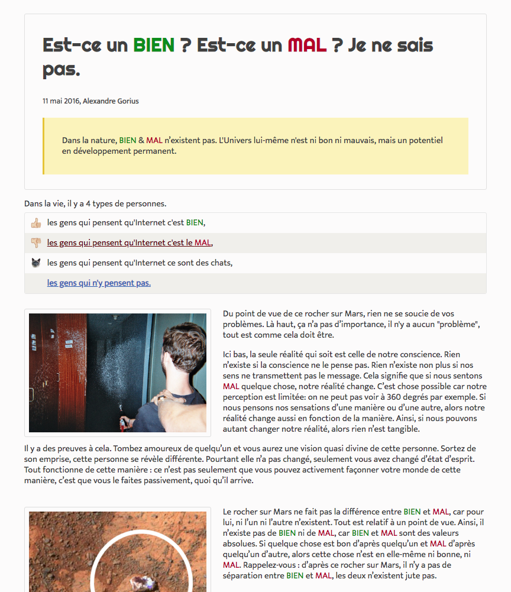

##Layout responsive and more ..
---
###Objective of the project

>the goal of the project is to achieve a sensitive layout with image integration, links and the use of different fonts. one of the key tests is the customization of `<ul> <li>` tags in the style.css file

###Tech used
>HTML5
CSS3

